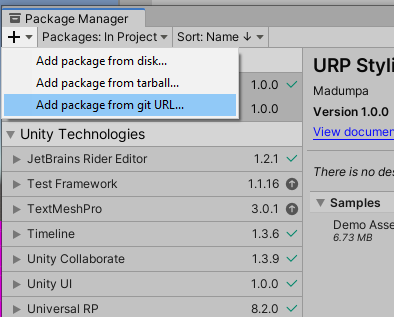
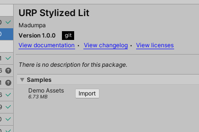
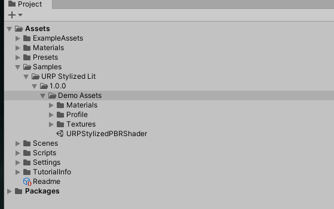

# URP_StylizedLitShader
URP Stylized Lit Shader Repository

[원본 전체 프로젝트](https://github.com/madumpa/URP_StylizedLitShader.git#main)

1. URP 세팅이 된 프로젝트를 열어주세요.
없는 경우 빈 URP 템플릿의 프로젝트를 생성해도 됩니다.

2. 유니티 에디터 상단 메뉴아이템에서 패키지 매니저를 열어주세요.
`Window` - `Package Manager`  
  
3. ` + ` 버튼을 눌러 Add package from git URL... 을 선택해주세요.
```
https://github.com/madumpa/URP_StylizedLitShader.git#packageManagerWork
```
을 붙여넣습니다.

  
  
4. 설치가 완료되면 Samples 탭을 열어 Demo Assets를 Import 합니다.  
  
  
  
5. 프로젝트 뷰에 생긴 데모 에셋 폴더의 데모 씬을 엽니다.  

  
